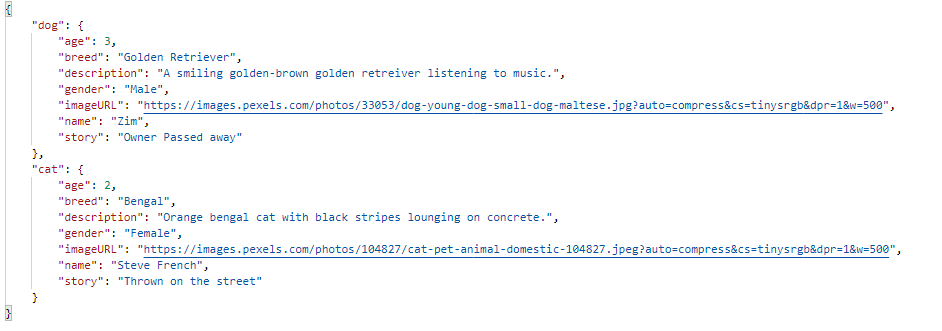
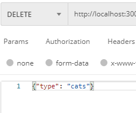
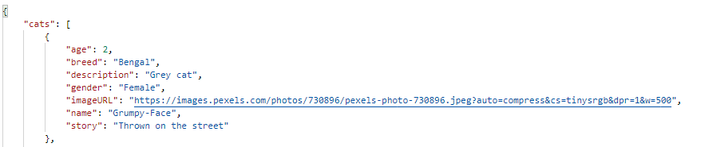
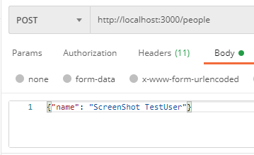

# Petful Back End

Keith Freitag and Agatha North

Endpoints:

## /pets:

**GET**: returns the two pets that are possible to adopt.

The format is:

Type(species):

- Age:
- Breed:
- Description:
- Gender:
- Image(the URL):
- Name:
- Story:

An example is as follows:

**Delete**: Deletes the pet of the chosen species.  The format is simple:

- Type: "cats" or "dogs"

An example is as follows:

## /pets/all

**GET**: Returns ALL the pets, not just the 2 available to currently be adopted.  The format is 
exactly as /pets GET.

## /people

**GET**: returns all the people in line.  The format is simple:

- people: 

And appears as follows:

**POST**: adds a person to the line.  The format is also simple:

- name: 

And appears as follows:

